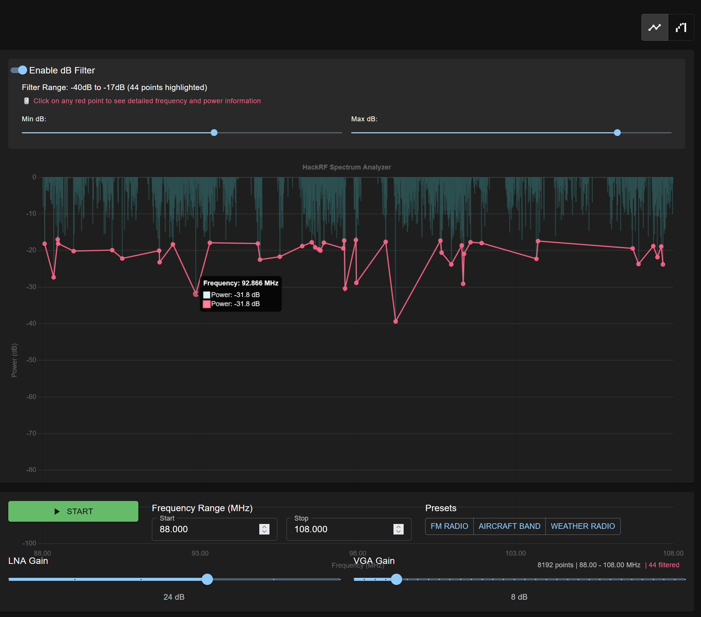

# HackRF WebUI - Spectrum Monitor & FM Receiver



An interactive web-based spectrum analyzer and FM receiver for HackRF One. Features real-time spectrum display and FM demodulation capabilities.

## Features

- Real-time spectrum monitoring with adjustable frequency range
- Click-to-listen FM demodulation
- WebSocket-based live updates
- Cross-platform compatibility (Windows, macOS, Linux)
- Dark theme UI with interactive controls
- Device safety features and automatic discovery

## Prerequisites

- Python 3.8 or higher
- Node.js 16 or higher
- HackRF One with SoapySDR installed
- Web browser with WebSocket support

## Installation

### 1. System Dependencies

First, install the required system packages:

```bash
# Ubuntu/Debian
sudo apt-get update
sudo apt-get install -y soapysdr-tools python3-soapysdr python3-venv hackrf

# macOS
brew install soapysdr hackrf

# Windows
# Install from the official SoapySDR and HackRF installers
```

### 2. WSL2 Setup (Windows Only)

If you're using WSL2 on Windows, you need to attach the HackRF device to WSL2:

1. Open PowerShell as Administrator and run:
```powershell
usbipd list                    # Note the bus-ID of the HackRF
usbipd bind --busid <BUS_ID>   # Share the device (run once per device; survives reboots)
usbipd attach --wsl --busid <BUS_ID>  # Powershell or CMD is fine, but ensure a WSL shell is open
```

2. Ensure the HackRF uses the WinUSB driver (use Zadig if needed).

3. The device should now be available in WSL2. You can verify with:
```bash
hackrf_info
```

### 3. Python Environment Setup

Create and activate a virtual environment with access to system packages (important for SoapySDR):

```bash
# Create a virtual environment with system packages access
python3 -m venv venv --system-site-packages

# Activate the virtual environment
# On Linux/macOS:
source venv/bin/activate
# On Windows:
.\venv\Scripts\activate

# Upgrade pip to latest version
python -m pip install --upgrade pip

# Install Python dependencies
pip install -r requirements.txt
```

### 4. Frontend Setup

Install and build the frontend:

```bash
cd frontend
npm install
```

## Running the Application

1. Make sure your virtual environment is activated:
```bash
# On Linux/macOS:
source venv/bin/activate
# On Windows:
.\venv\Scripts\activate
```

2. Run the application:
```bash
# Option 1: Run both backend and frontend together
./run.py

# Option 2: Run separately
# Terminal 1 - Backend
python backend/main.py

# Terminal 2 - Frontend
cd frontend
npm start
```

3. Open your web browser and navigate to `http://localhost:3000`

## Development Setup

If you want to modify the code:

1. Activate the virtual environment as shown above
2. Install development dependencies:
```bash
pip install black pylint pytest
```

3. Before committing changes:
```bash
# Format code
black backend/

# Run tests (when available)
pytest
```

## Troubleshooting

1. If you see permission errors with HackRF:
```bash
sudo usermod -a -G plugdev $USER
```
Then log out and back in.

2. If SoapySDR is not found in Python:
   - Ensure you created the virtual environment with `--system-site-packages`
   - Verify system-level installation: `python3 -c "import SoapySDR; print(SoapySDR.Device.enumerate())"`
   - If not found, reinstall system packages: `sudo apt-get install --reinstall python3-soapysdr soapysdr-tools`

3. If the virtual environment isn't working:
```bash
# Remove the old environment
rm -rf venv

# Create a new one with system packages
python3 -m venv venv --system-site-packages
source venv/bin/activate
pip install -r requirements.txt
```

4. If you see "No HackRF devices found":
   - Check device connection: `hackrf_info`
   - Verify USB permissions
   - For WSL2: Ensure device is properly attached using `usbipd`

## API Documentation

The backend exposes both REST and WebSocket endpoints:

- `GET /api/devices` - List connected HackRF devices
- `POST /api/sweep/start` - Start spectrum sweep
- `POST /api/sweep/stop` - Stop spectrum sweep
- `POST /api/tune` - Tune to specific frequency for FM demodulation
- `WebSocket /ws/spectrum` - Real-time spectrum data
- `WebSocket /ws/audio` - Demodulated audio stream

## License

MIT License